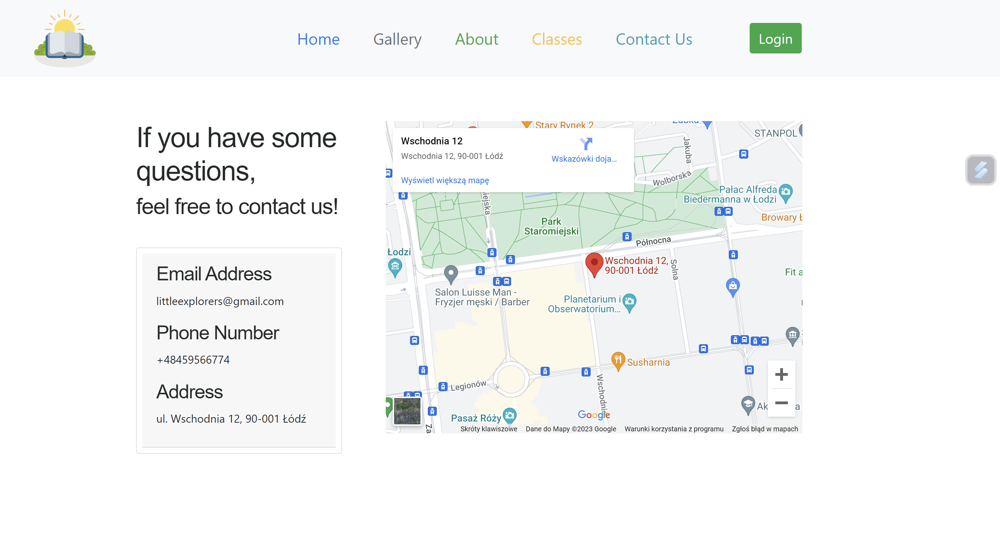
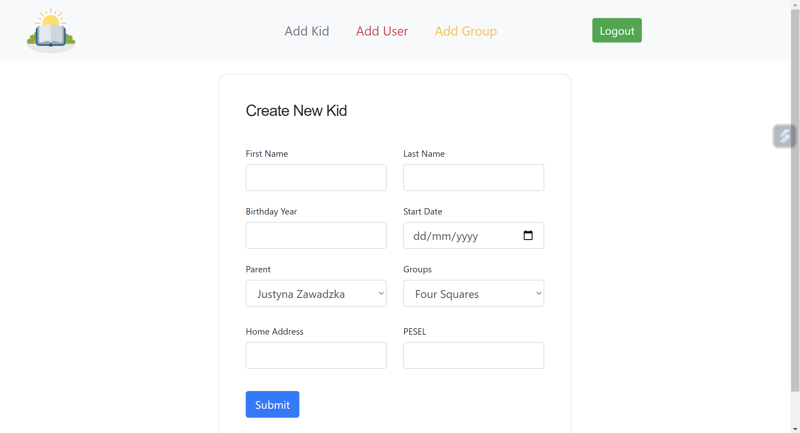

# Kindergarten
## Table of contents
* [Introduction](#introduction)
* [Technologies](#technologies)
* [Illustrations](#illustrations)

## Introduction
    I've created a website for kindergarten with full management system for Admin user, teachers and parents.
    Non-registered parents and visitors can learn more about kindergarten's history, mission, 
    fees and additional classes. Admin have access to all advanced futures, such as: adding new users,
    kids and groups. Parents can check their kids information and money balance. Teachers are allowed
    to see information about children in their groups. Hope You will enjoy it! 
    
## Technologies
* PHP
* HTML
* Bootstrap
* CSS
* JavaScript
* Xampp

## Illustrations
|  Homepage         |       Classes |
| ------------------ | --------------- |
|| |

| Gallery             |        Login   |
| ------------------ | --------------- |
|  |  |

| Contact Us         |         Create New User |
| ------------------ | --------------- |
|| |

